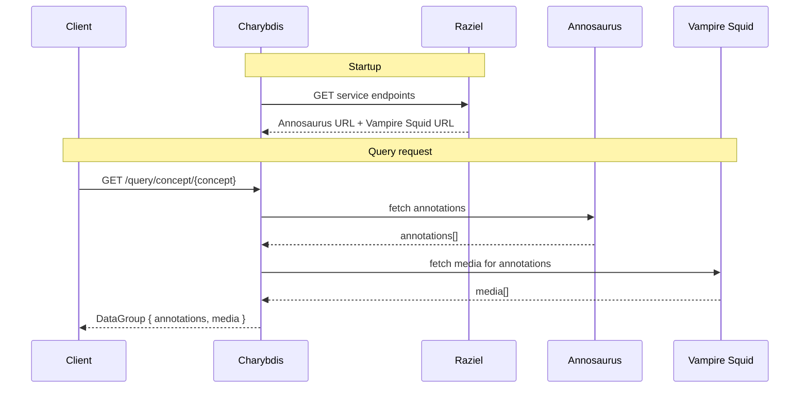

# Architecture

## VARS Services

Charybdis is part of the [VARS](https://mbari-org.github.io/vars/) (Video Annotation Reference System) platform. Four services collaborate to provide annotation and media data:

| Service | Role |
|---|---|
| **Raziel** | Service discovery — provides live endpoints for other VARS services |
| **Annosaurus** | Annotation service — stores and queries video frame observations |
| **Vampire Squid** | Media service — stores and queries video and media metadata |
| **Charybdis** | Aggregation layer — federates queries across Annosaurus and Vampire Squid |

## How It Works

When Charybdis starts, it queries Raziel to discover the live URLs for Annosaurus and Vampire Squid. These endpoints are cached for the lifetime of the process.

On each query request, Charybdis:

1. Fetches matching annotations from Annosaurus
2. Fetches the associated media records from Vampire Squid
3. Returns both as a single `DataGroup` response



## Response Shape

All query endpoints return a `DataGroup`:

```json
{
  "annotations": [ ... ],
  "media": [ ... ]
}
```

- **`annotations`** — observation records from Annosaurus, each tied to a video frame (concept name, timestamp, observer, associated image/data links)
- **`media`** — video reference records from Vampire Squid (URI, start timestamp, duration, video sequence name)
