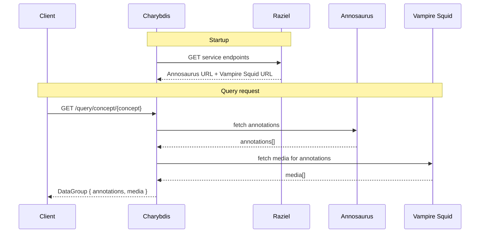

# Charybdis Documentation Implementation Plan

> **For agentic workers:** REQUIRED SUB-SKILL: Use superpowers:subagent-driven-development (recommended) or superpowers:executing-plans to implement this plan task-by-task. Steps use checkbox (`- [ ]`) syntax for tracking.

**Goal:** Create five markdown documentation pages under `docs/` for Charybdis, targeted at operators deploying via Docker and developers building the image.

**Architecture:** Each page maps 1:1 to a file under `docs/`. The `zensical.toml` nav is updated to match. No code changes — documentation only. Content is sourced from the existing README and source files.

**Tech Stack:** Markdown, Mermaid (via pymdownx.superfences), zensical/MkDocs Material theme.

---

### Task 1: Update `zensical.toml` nav

**Files:**
- Modify: `zensical.toml`

- [ ] **Step 1: Replace the nav section**

Open `zensical.toml`. Find the existing `nav` array under `[project]` (lines 7–13) and replace it with:

```toml
nav = [
    { "Home" = "index.md" },
    { "Architecture" = "architecture.md" },
    { "Deployment" = "deployment.md" },
    { "Configuration" = "configuration.md" },
    { "Building" = "build.md" },
]
```

- [ ] **Step 2: Verify the file parses**

```bash
cat zensical.toml
```

Expected: the nav block shows the five entries above. No TOML syntax errors (all braces/brackets balanced).

- [ ] **Step 3: Commit**

```bash
git add zensical.toml
git commit -m "docs: update zensical nav for operator docs"
```

---

### Task 2: Create `docs/index.md`

**Files:**
- Create: `docs/index.md`

- [ ] **Step 1: Write the file**

Create `docs/index.md` with the following content:

````markdown
# Charybdis

Charybdis is a query aggregation service for MBARI's [VARS](https://mbari-org.github.io/vars/) (Video Annotation Reference System). It federates queries across two backend services — **Annosaurus** (annotations) and **Vampire Squid** (media/video metadata) — and returns a combined response in a single `DataGroup` object:

```json
{ "annotations": [...], "media": [...] }
```

Service endpoints are resolved at startup via **Raziel**, the VARS configuration service.

The interactive API docs are available at `http://localhost:8080/q/swagger-ui` once the service is running.

---

| Page | Description |
|---|---|
| [Architecture](architecture.md) | How Charybdis fits into the VARS stack |
| [Deployment](deployment.md) | Run Charybdis with Docker |
| [Configuration](configuration.md) | All configuration properties and environment variable overrides |
| [Building](build.md) | Build the Docker image from source |
````

- [ ] **Step 2: Verify**

```bash
cat docs/index.md
```

Expected: file exists, contains the table with four links, contains the JSON example block, no broken markdown (all backtick fences closed).

- [ ] **Step 3: Commit**

```bash
git add docs/index.md
git commit -m "docs: add home page"
```

---

### Task 3: Create `docs/architecture.md`

**Files:**
- Create: `docs/architecture.md`

- [ ] **Step 1: Write the file**

Create `docs/architecture.md` with the following content:

````markdown
# Architecture

## VARS Services

Charybdis is part of the [VARS](https://mbari-org.github.io/vars/) (Video Annotation Reference System) platform. Four services collaborate to provide annotation and media data:

| Service | Role |
|---|---|
| **Raziel** | Service discovery — provides live endpoints for other VARS services |
| **Annosaurus** | Annotation service — stores and queries video frame observations |
| **Vampire Squid** | Media service — stores and queries video and media metadata |
| **Charybdis** | Aggregation layer — federates queries across Annosaurus and Vampire Squid |

## How It Works

When Charybdis starts, it queries Raziel to discover the live URLs for Annosaurus and Vampire Squid. These endpoints are cached for the lifetime of the process.

On each query request, Charybdis:

1. Fetches matching annotations from Annosaurus
2. Fetches the associated media records from Vampire Squid
3. Returns both as a single `DataGroup` response



## Response Shape

All query endpoints return a `DataGroup`:

```json
{
  "annotations": [ ... ],
  "media": [ ... ]
}
```

- **`annotations`** — observation records from Annosaurus, each tied to a video frame (concept name, timestamp, observer, associated image/data links)
- **`media`** — video reference records from Vampire Squid (URI, start timestamp, duration, video sequence name)
````

- [ ] **Step 2: Verify**

```bash
cat docs/architecture.md
```

Expected: file exists, contains the Mermaid sequence diagram inside a ` ```mermaid ` fence, contains the service roles table, contains the JSON response shape example. All fences closed.

- [ ] **Step 3: Commit**

```bash
git add docs/architecture.md
git commit -m "docs: add architecture page with Mermaid diagram"
```

---

### Task 4: Create `docs/deployment.md`

**Files:**
- Create: `docs/deployment.md`

- [ ] **Step 1: Write the file**

Create `docs/deployment.md` with the following content:

````markdown
# Deployment

## Prerequisites

Charybdis requires a running VARS stack:

- **Raziel** — configuration/service-discovery service (default port 8085)
- **Annosaurus** — annotation service
- **Vampire Squid** — media service

Raziel must be reachable by Charybdis at startup. Annosaurus and Vampire Squid must be reachable via the URLs that Raziel provides.

## Running with Docker

```shell
docker run -i --rm -p 8080:8080 \
  -e RAZIEL_SERVICE_URL=http://your-raziel-host:8085 \
  mbari/charybdis
```

Replace `http://your-raziel-host:8085` with the URL where Raziel is running.

## Verifying

Once running, confirm Charybdis is healthy:

```shell
curl http://localhost:8080/q/health
```

A healthy response returns `{"status":"UP",...}`.

The interactive API docs are available at:

```
http://localhost:8080/q/swagger-ui
```

## Tuning

To adjust timeouts, page sizes, or JSON output format, see [Configuration](configuration.md).
````

- [ ] **Step 2: Verify**

```bash
cat docs/deployment.md
```

Expected: file exists, contains the `docker run` command with `-e RAZIEL_SERVICE_URL`, contains the `curl /q/health` verification step, link to `configuration.md` present. All fences closed.

- [ ] **Step 3: Commit**

```bash
git add docs/deployment.md
git commit -m "docs: add deployment page"
```

---

### Task 5: Create `docs/configuration.md`

**Files:**
- Create: `docs/configuration.md`

- [ ] **Step 1: Write the file**

Create `docs/configuration.md` with the following content:

````markdown
# Configuration

## Environment Variable Overrides

Any `application.properties` key can be overridden at runtime by setting an environment variable: uppercase all letters and replace `.` with `_`.

| Property | Environment variable |
|---|---|
| `raziel.service.url` | `RAZIEL_SERVICE_URL` |
| `annotation.service.timeout` | `ANNOTATION_SERVICE_TIMEOUT` |
| `annotation.service.pagesize` | `ANNOTATION_SERVICE_PAGESIZE` |
| `media.service.timeout` | `MEDIA_SERVICE_TIMEOUT` |
| `quarkus.http.port` | `QUARKUS_HTTP_PORT` |
| `charybdis.jackson.property-naming-strategy` | `CHARYBDIS_JACKSON_PROPERTY_NAMING_STRATEGY` |

Pass overrides to `docker run` with `-e`:

```shell
docker run -i --rm -p 8080:8080 \
  -e RAZIEL_SERVICE_URL=http://raziel:8085 \
  -e ANNOTATION_SERVICE_TIMEOUT=PT3M \
  mbari/charybdis
```

## Property Reference

| Property | Default | Description |
|---|---|---|
| `raziel.service.url` | `http://localhost:8085` | Raziel endpoint for service discovery |
| `annotation.service.timeout` | `PT2M` (2 minutes) | Timeout for Annosaurus requests |
| `annotation.service.pagesize` | `1000` | Page size for paginated Annosaurus fetches |
| `media.service.timeout` | `PT10S` (10 seconds) | Timeout for Vampire Squid requests |
| `quarkus.http.port` | `8080` | HTTP port |
| `charybdis.jackson.property-naming-strategy` | `LOWER_CAMEL_CASE` | JSON property naming: `LOWER_CAMEL_CASE` or `SNAKE_CASE` |

## JSON Naming Strategy

By default, Charybdis returns camelCase JSON property names (e.g., `videoReferenceUuid`, `recordedTimestamp`). To switch to snake_case (e.g., `video_reference_uuid`, `recorded_timestamp`):

```shell
-e CHARYBDIS_JACKSON_PROPERTY_NAMING_STRATEGY=SNAKE_CASE
```
````

- [ ] **Step 2: Verify**

```bash
cat docs/configuration.md
```

Expected: file exists, contains both the env-var mapping table and the full property reference table, contains the snake_case example. All fences closed.

- [ ] **Step 3: Commit**

```bash
git add docs/configuration.md
git commit -m "docs: add configuration reference page"
```

---

### Task 6: Create `docs/build.md`

**Files:**
- Create: `docs/build.md`

- [ ] **Step 1: Write the file**

Create `docs/build.md` with the following content:

````markdown
# Building

## Prerequisites

- Java 21
- Maven 3.9+ — or use the included `./mvnw` wrapper (no separate Maven installation required)
- Docker

## Build the JAR

```shell
./mvnw package
```

This produces a fast-jar layout under `target/quarkus-app/`.

## Build the Docker Image

```shell
docker build -f src/main/docker/Dockerfile.jvm -t mbari/charybdis .
```

## Run Locally

```shell
docker run -i --rm -p 8080:8080 \
  -e RAZIEL_SERVICE_URL=http://your-raziel-host:8085 \
  mbari/charybdis
```

## Native Image (Optional)

To build a GraalVM native image without a local GraalVM installation, use the container build:

```shell
./mvnw package -Dnative -Dquarkus.native.container-build=true
```

The resulting native binary is placed in `target/`.
````

- [ ] **Step 2: Verify**

```bash
cat docs/build.md
```

Expected: file exists, contains `./mvnw package`, `docker build -f src/main/docker/Dockerfile.jvm`, the `docker run` command, and the native image option. All fences closed.

- [ ] **Step 3: Commit**

```bash
git add docs/build.md
git commit -m "docs: add developer build page"
```
